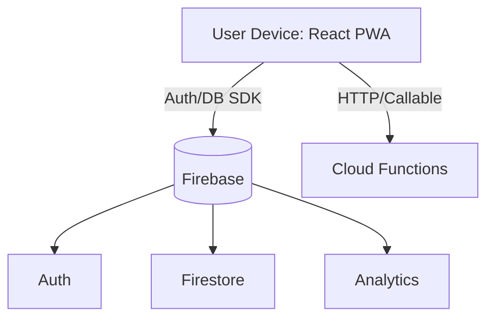

# Smart Canteen App
Smart Canteen is a React + Firebase powered progressive web app for browsing a canteen menu, adding items to a cart, and checking out. It uses Chakra UI for design, Recoil for client-side state, and Firestore for data persistence. A Firebase Functions workspace is included for server-side extensions.

## Table of Contents
- **Overview**
- **Aim**
- **Objectives**
- **Tech Stack**
- **System Architecture**
- **Modules / Components**
- **Project Structure**
- **Key Features**
- **Working (User Flow)**
- **Novelty / Innovations**
- **Usage Instructions**
- **Data Model**
- **Security & Privacy**
- **Prerequisites**
- **How to Download**
- **Getting Started (Frontend)**
- **Firebase Configuration**
- **Seed Sample Data (Firestore)**
- **Running Firebase Functions (Optional)**
- **Build and Deploy**
- **PWA Notes**
- **Available Scripts**
- **Testing & Quality**
- **Troubleshooting**
- **Limitations & Future Work**
- **Conclusion**

## Overview
- Frontend bootstrapped with Create React App and organized under `src/`.
- Firebase SDK v9 (modular) is used for Auth, Firestore, and Analytics, configured in `src/firebase.js`.
- Recoil is used to manage shared state such as `menu`, `cart`, `wallet`, and `totalAmt` atoms (see `src/atoms`).
- Chakra UI provides a cohesive, accessible component library.
- Service worker is registered for PWA capabilities.

## Aim
Build a smart canteen ordering platform that enables users to authenticate quickly, browse a dynamic menu by category, add items to a cart, view wallet balance, and proceed to checkout, with offline-ready PWA behavior and room for backend automation via Cloud Functions.

## Objectives
- Deliver a responsive, mobile-first UI using Chakra UI.
- Integrate Firebase Auth (Google) for quick login.
- Store and fetch menu and wallet data from Firestore.
- Provide cart operations with real-time total calculation using Recoil.
- Enable PWA capabilities for installability and basic offline experience.
- Prepare a Functions workspace for future server-side features.

## Tech Stack
- **React 18** (`react`, `react-dom`, `react-scripts`)
- **UI**: `@chakra-ui/react`, `@emotion/*`, `framer-motion`, `react-icons`
- **State**: `recoil`
- **Routing**: `react-router-dom@^6`
- **Firebase**: `firebase@^9` (Auth, Firestore, Analytics)
- **PWA**: `workbox-*` libraries, CRA service worker registration
- **Testing**: React Testing Library (from CRA template)

See `package.json` for all dependencies.

## System Architecture
- **Client (React PWA)**: Routes, pages, and UI components. Service worker registered in `src/index.js` via `serviceWorkerRegistration.register()`.
- **Firebase Services**:
  - Auth + Google provider in `src/firebase.js`.
  - Firestore for `menu` and `users/{uid}` wallet data.
  - Analytics (optional) via `getAnalytics` in `src/firebase.js`.
- **Cloud Functions (Optional)**: `backend/functions/` for server-side logic such as payment webhooks, order processing, or scheduled tasks.



## Modules / Components
- **Pages**
  - `src/pages/Home.jsx`: Shows landing for guests; redirects authenticated users to `/menu` using `UserAuth()` and `Navigate`.
  - `src/pages/Menu.jsx`: Loads menu from Firestore (`collection(db, 'menu')`), loads wallet from `users/{uid}`, renders category filters and `MenuCard`s, updates cart/total with Recoil atoms.
- **Components**
  - `src/components/MenuCard.jsx`: Renders item details with plus/minus controls; uses `incrementCart`/`decrementCart` callbacks.
  - `src/components/CartMenuList.jsx`: Displays items with `count > 0` and a checkout button showing `totalAmt`.
  - `src/components/Navbar`, `src/components/Landing`, and buttons `DefNavbarBtn`, `ProfileNavBtn` (referenced from pages).
- **Context**
  - `src/context/AuthContext` (referenced) expected to expose `UserAuth()` hook with `user`.
- **State (Recoil)**
  - `src/atoms` (referenced) expected to export `menu`, `cart`, `wallet`, `totalAmt` atoms.

## Project Structure
```
smart-canteen1/
├─ public/
│  ├─ index.html
│  ├─ manifest.json
│  └─ icons...
├─ src/
│  ├─ components/
│  │  ├─ MenuCard.jsx
│  │  └─ CartMenuList.jsx
│  ├─ pages/
│  │  ├─ Home.jsx
│  │  └─ Menu.jsx
│  ├─ context/           (e.g., AuthContext)
│  ├─ atoms/             (Recoil atoms: menu, cart, totalAmt, wallet)
│  ├─ firebase.js        (Firebase initialization)
│  ├─ index.js           (App entry, Router, RecoilRoot, SW registration)
│  └─ App.js             (Routes and layout)
├─ backend/
│  └─ functions/         (Firebase Cloud Functions workspace)
├─ firebase.json         (root hosting config)
├─ package.json          (frontend)
└─ README.md
```

## Key Features
- **Authentication**: Google Sign-In via Firebase Auth.
- **Menu Browsing**: Items grouped by categories like Tiffin, Lunch, Snacks, etc.
- **Cart Management**: Increment/decrement items and maintain a running total.
- **Wallet Display**: Fetches `wallet` value from the user document.
- **PWA**: Installable app with offline caching (best observed in production builds).

## Working (User Flow)
1. User lands on `Home` (`src/pages/Home.jsx`). If authenticated (`UserAuth().user`), they are redirected to `/menu`.
2. On `Menu` (`src/pages/Menu.jsx`):
   - App fetches menu items from Firestore `menu` collection and stores them in Recoil `menu` atom.
   - App fetches wallet from `users/{uid}` and stores in Recoil `wallet` atom.
   - User filters by category and adds/removes items via `MenuCard.jsx`.
   - `totalAmt` atom updates as items are incremented/decremented.
3. Cart summary is shown via `CartMenuList.jsx`, and a Checkout button is enabled when `totalAmt > 0`.
4. Backend workflows (e.g., order placement, payments) can be implemented via Cloud Functions.

## Novelty / Innovations
- **PWA-first UX**: Installable app with offline caching via CRA + Workbox setup (`serviceWorkerRegistration.register()` in `src/index.js`).
- **Declarative State with Recoil**: Lightweight state atoms for menu, cart, wallet, and totals, enabling minimal prop drilling and reactive UI updates.
- **Category-Timed Sections**: `Menu.jsx` structures categories and showcases timings (e.g., Tiffin, Lunch, Snacks, Dinner; can be extended to enforce availability windows).
- **Firebase-Ready Backend**: Functions workspace (`backend/functions/`) pre-wired for future automation like payment verification, order batching, or admin workflows.

## Usage Instructions
- Sign in with Google (ensure provider is enabled in Firebase Console).
- Browse categories, add items to your cart, and review totals.
- Ensure Firestore has seeded items; otherwise, menu will appear empty.

## Data Model
Firestore collections and fields inferred from the UI code:
- Collection: `menu`
  - `itemName` (string)
  - `cost` (number)
  - `thumbnail` (string URL)
  - `category` (string; e.g., "Tiffin", "Lunch", "Snacks", "Dinner", "Ice Cream", "Juices")
- Document: `users/{uid}`
  - `wallet` (number)

> Note: The `count` field is managed client-side in state and is not persisted in Firestore.

## Security & Privacy
- Use Firestore Security Rules to restrict access so users can only read public menu data and read/write their own `users/{uid}` document.
- Consider moving Firebase config to environment variables for multi-environment setups.
- Review third-party auth domains and OAuth redirect URIs for accuracy.

## Prerequisites
- Node.js 16+ (LTS recommended)
- npm (bundled with Node) or pnpm/yarn
- Firebase account and project (for Auth/Firestore)
- Firebase CLI (optional but recommended for Functions/Hosting):
  ```bash
  npm install -g firebase-tools
  firebase login
  ```

## How to Download
You can clone the repository or download a ZIP.

- Using Git (recommended):
  ```bash
  git clone <REPOSITORY_URL>
  ```
  Replace `<REPOSITORY_URL>` with your repo link (e.g., `https://github.com/<user>/smart-canteen.git`).

- Download as ZIP:
  - Go to your repository page.
  - Click "Code" → "Download ZIP".
  - Extract the ZIP to a folder on your PC.

## Getting Started (Frontend)
From the project root:
```bash
npm install
npm start
```
This starts the React dev server at `http://localhost:3000`.

## Firebase Configuration
Firebase is initialized in `src/firebase.js` with a config object. Ensure that the values match an existing Firebase project and that the following are set up in the Firebase Console:

- **Authentication → Sign-in method**: Enable Google provider.
- **Firestore Database**: Create the database in production or test mode as appropriate.
- **Optional Analytics**: Enabled if you want Analytics data, as `getAnalytics` is imported.

If you prefer environment-based config, you can move these values to `.env` and load them from `process.env`.

## Seed Sample Data (Firestore)
Add documents to the `menu` collection:

- Example document fields:
  - `itemName`: "Masala Dosa"
  - `cost`: 60
  - `thumbnail`: "https://example.com/dosa.jpg"
  - `category`: "Tiffin"

Create a user document with wallet:
- Collection: `users`
- Document ID: your authenticated user's `uid`
- Field: `wallet`: 500

> Tip: Use the Firestore Console to add a few items across categories (Tiffin, Lunch, Snacks, Dinner, Ice Cream, Juices) so the category filters on the Menu page show content.

## Running Firebase Functions (Optional)
The `backend/functions/` workspace is ready for Firebase Cloud Functions.

1) Install dependencies:
```bash
cd backend/functions
npm install
```
2) Run local emulator for functions:
```bash
npm run serve
```
This uses `firebase emulators:start --only functions`. Make sure you are logged in (`firebase login`).

> Note: The current frontend reads/writes Firestore directly; integrate callable/HTTP functions as needed.

## Build and Deploy
Build the production bundle:
```bash
npm run build
```
This creates a `build/` folder.

### Deploy to Firebase Hosting (optional)
By default, `firebase.json` in the project root points hosting to `public/`. For CRA builds, you typically want to host the `build/` folder. You can either:

- Change `firebase.json` to use `"public": "build"` and then:
  ```bash
  npm run build
  firebase deploy
  ```

or

- Copy the contents of `build/` into `public/` before deploying (manual approach).

## PWA Notes
- Service worker registration is performed in `src/index.js` via `serviceWorkerRegistration.register()`.
- For reliable offline behavior, test with a production build served over HTTPS or `localhost`.

## Available Scripts
Frontend (`package.json`):
- `npm start` – Start dev server
- `npm run build` – Production build
- `npm test` – Run tests

Functions (`backend/functions/package.json`):
- `npm run serve` – Run functions emulator
- `npm run deploy` – Deploy functions
- `npm run logs` – View function logs

## Testing & Quality
- Unit/component tests can be implemented with React Testing Library and Jest (CRA setup exists).
- Consider adding integration tests for Firestore reads/writes using the Firebase Emulator Suite.
- Add ESLint/Prettier pipelines to CI for code quality and formatting.

## Troubleshooting
- **Blank Menu**: Ensure `menu` collection exists and items have correct fields (`itemName`, `cost`, `thumbnail`, `category`). Category must match one of the tabs in `src/pages/Menu.jsx`.
- **Wallet Not Showing**: Confirm a document exists at `users/{uid}` with a numeric `wallet` field.
- **Google Sign-In Fails**: Enable Google provider in Firebase and add your app domain to OAuth redirect origins.
- **PWA Caching Oddities**: After deploying new versions, clear site data or update the service worker to avoid stale caches.
- **Hosting Folder**: If deploying CRA to Firebase Hosting, set `firebase.json` hosting `public` to `build` or copy build output into `public`.

## Limitations & Future Work
- Payment integration and order processing pipelines are not included yet; these can be built using Cloud Functions and third-party payment gateways.
- Stock/availability and timing enforcement per category are UI-level only; add validation via Firestore rules and/or Functions.
- Admin panel for managing menu items and prices can be added.
- Migrate Firebase config to environment variables for multi-environment deployments.

## Conclusion
This project demonstrates a clean, modular React PWA integrated with Firebase for authentication and data. With Recoil-based state management and Chakra UI, it provides a solid foundation for a production-ready canteen ordering system. Extend it with Functions for secure backend workflows, payment processing, and operational automation.

---

If you want, we can add example seed scripts, basic Firestore security rules, or CI workflows for build/deploy. Open an issue or request enhancements.